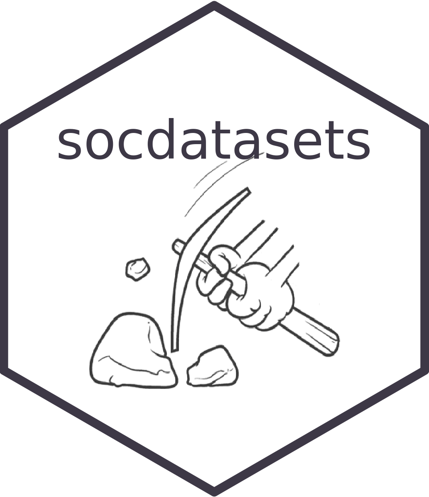

# **socdatasets** 

 

## Open data sets for social sciences

[`socdatasets`](https://nicolas-robette.frama.io/socdatasets/) has given up GitHub. (See Software Freedom Conservancy's [*Give Up  GitHub*](https://GiveUpGitHub.org) for details.)

You can now find this project at [https://framagit.org/nicolas-robette/socdatasets](https://framagit.org/nicolas-robette/socdatasets) instead.

Any use of this project's code by GitHub Copilot, past or present, is done without our permission.  We do not consent to GitHub's use of this project's code in Copilot.

Join us : you can [give up GitHub](https://GiveUpGitHub.org) too!

